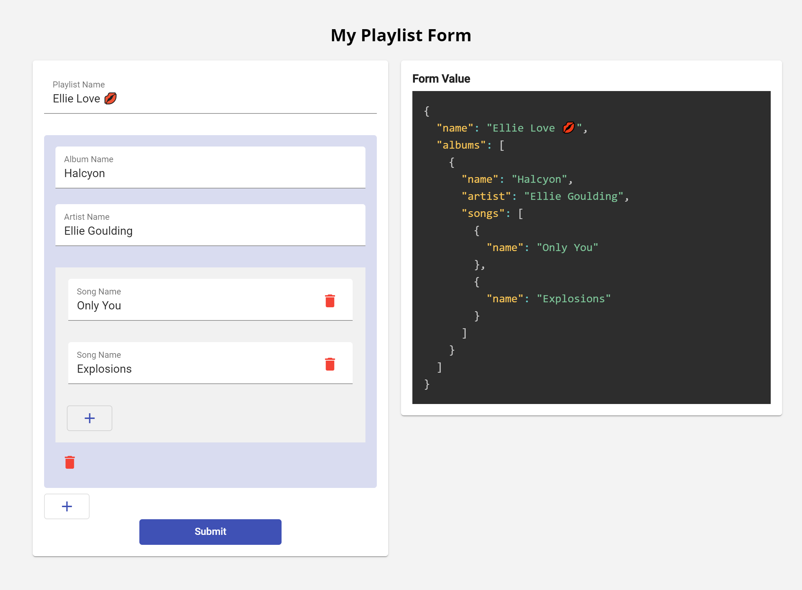

# Angular Form Arrays Interactive Playground

Form Arrays provides us a way to dynamically manage fields, meaning we can add to remove fields on the fly. Form Groups and Form Arrays are just a ways to manage fields.

This is an interactive playground for learning Angular Form Arrays.

## Get Started

1. Clone the repository or Download the zip.
1. Install the dependencies: `npm install`
1. Run the application using the command: `npm run start`

Follow
